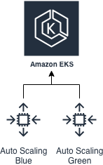

# EKS node upgrade

One of the challenges when running [Kubernetes](https://kubernetes.io/) is changing the worker nodes and upgrading them with as less impact as possible to the running applications. This is no different when using [EKS](https://aws.amazon.com/eks/). The problem is that there are two systems, Kubernetes and AWS, which need to work together to accomplish this. Currently, although they are aware of each other in some way they do not work together to accomplish a very simple sounding requirement: *Update the nodes with the new configuration and move the running applications to them and if it fails revert it back.* There are many ways to solve this problem and this is our way to do this.

## How does it work

Whenever you want to update an AMI or some configuration to the worker nodes you want to be able to do that with the certainty that the application will not experience downtime. To achieve this we will use two Auto Scale Groups in AWS called blue and green. One of the ASGs is active, meaning it has instances running while the other one is scaled to zero.

As soon as you make a change the inactive ASG gets scaled to the same instance count as the active, the pods get rescheduled to the new nodes, when all pods are rescheduled the active ASG is scaled down and the inactive ASG becomes active. In case something fails, pods are rescheduled back and the inactive ASG is scaled down and failure is escalated. This principle allows automatic changes and although it can't fix the problem it can deescalate it by reverting back.

- Drawing explaining what happens

## Try it out

- Create cluster
- Make sure we have two ASGs
- Make a change to one ASG
- Run script

## Production usage

### As part of the CI/CD

Explane how it works as part of the CI/CD. (TODO: make a try it out, maybe cicrleci, or some other cicd)

### Standalone

Explain how it can work as lambda which you just trigger (TODO: make a try it out)

## The script

- Explain why we use tags
- Any other things that need to be explained?

## TODO

- Explain everything in the readme
- Create the script
- Publish python script ?
- Create docker?
- If we create lambda, publish it to lambda market place?
